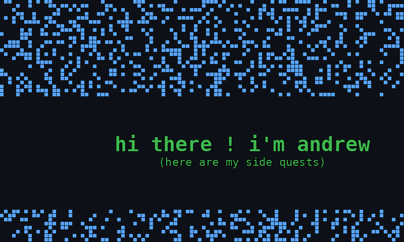

*Conway's Game of Life - 8 FPS animation*

## 
I'm Andrew, and I write spaghetti code sometimes. I usually work on projects or problems that I find interesting or challenging.

I like learning about niche low-level details and wonky optimizations.

I'm also an avid chess programmer—my chess engine [Tuna](https://github.com/andrew-y-xia/Tuna) plays at ~2950 elo. I play at like 900 elo.

I try thinking about concurrency a lot, both on distributed-scale and processor-scale. On the processor side, it'll be a while until I can reliably write lock-free data structures. On the distributed side, I'm currently working on a project similar to Google's distributed SQL database, [Spanner](https://static.googleusercontent.com/media/research.google.com/en//archive/spanner-osdi2012.pdf).

---

> tl;dr — I poke at low-level weirdness, concurrency shenanigans, and computer chess

	
<b>Random things corner</b> (click to expand)

	- I like thinking about memory models, cache coherence, and when a "minor" branch mispredict is actually your whole problem.
	- On the distributed side: time, sharding, and whatever it means to be web scale
	- On the CPU side: pipelining, atomics, and misinterpreting what memory_order_acquire really entails
    - I love cursed software and cursed things about programming languages

---

If anything sounds fun to talk about, reach out at andrew.xia@princeton.edu!
